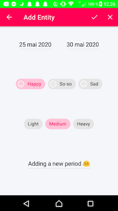

# Telle
(In progress). A simple period tracker app which does not share any personal data. The code is heavily inspired by the "Sunflower" app and Android's best practises: https://github.com/android/sunflower/.

## Screenshots

## Libraries
- [Room][0] - For accessing the SQLite database
- [ViewModel][3] - Manage data in a lifecycle-concious way
- [LiveData][2] - For observing data
- [Fragment][5] - For flexible UI designs
- [Layout][4] - For defining the structure of the UI
- [Data Binding][1] - For binding layout to views

[0]: https://developer.android.com/topic/libraries/architecture/room 
[1]: https://developer.android.com/topic/libraries/data-binding/
[2]: https://developer.android.com/topic/libraries/architecture/livedata
[3]: https://developer.android.com/topic/libraries/architecture/viewmodel
[4]: https://developer.android.com/guide/topics/ui/declaring-layout
[5]: https://developer.android.com/guide/components/fragments

## Todos
- Update AddEntityActivity to use data binding.
- Add more ChipGroups with symptom options
- Add symptoms on a single-day basis.
- Display more symptoms in list_item_episode.xml.
- Add a "backup" option.
- Implement further analysis of the data
